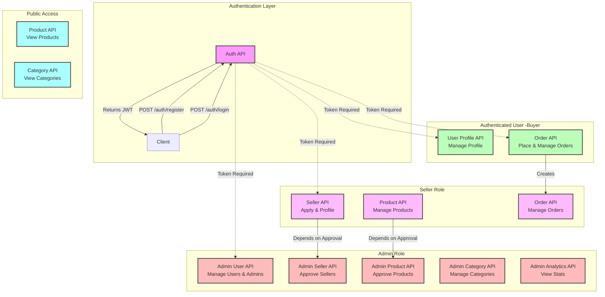

# fanforge-backend

# FanForge API Documentation

This document provides a visual and detailed overview of the FanForge Backend APIs. It outlines the available endpoints, their access levels, and the general flow of data within the application.

## API Architecture & Flow

The following Mermaid diagram visualizes the API structure, grouped by functionality and user roles. It also depicts the high-level flow from Authentication to specific features.

## detailed API Reference

### 1. Authentication
**Base URL:** `/api/auth`
- **POST** `/register` - Register a new user.
- **POST** `/login` - Login and receive a JWT.
- **GET** `/me` - Get current authenticated user's info.

### 2. User Management
**Base URL:** `/api/users`
- **GET** `/profile` - Get current user's profile.
- **PUT** `/profile` - Update current user's profile.

### 3. Seller Management
**Base URL:** `/api/seller`
- **POST** `/apply` - Apply to become a seller.
- **GET** `/profile` - Get seller profile details.
- **PUT** `/profile` - Update seller profile details.

### 4. Products
**Base URL:** `/api/products`
User Roles: Public, Seller

**Public:**
- **GET** `/` - List all approved products.
- **GET** `/:id` - Get details of a single product.

**Seller Only:**
- **POST** `/` - Create a new product.
- **GET** `/seller/my-products` - List logged-in seller's products.
- **PUT** `/:id` - Update a product.
- **DELETE** `/:id` - Delete a product.

### 5. Orders
**Base URL:** `/api/orders`
User Roles: Buyer, Seller

**Buyer:**
- **POST** `/` - Place a new order.
- **GET** `/buyer/my-orders` - List logged-in buyer's orders.
- **PUT** `/:id/cancel` - Cancel an order.

**Seller:**
- **GET** `/seller/my-orders` - List orders received by the seller.
- **PUT** `/:id/status` - Update order status.

### 6. Categories
**Base URL:** `/api/categories`
- **GET** `/` - List all categories.
- **GET** `/:id` - Get details of a category.

### 7. Admin Modules
**Requires Role:** `ADMIN` or `SUPER_ADMIN`

#### Admin Users
**Base URL:** `/api/admin/users`
- **GET** `/` - List all users.
- **GET** `/:id` - Get user details.
- **DELETE** `/:id/ban` - Ban a user.
- **PUT** `/:id/unban` - Unban a user.
- **POST** `/admins` - Add a new admin (Super Admin only).
- **DELETE** `/admins/:id` - Remove an admin (Super Admin only).

#### Admin Sellers
**Base URL:** `/api/admin/sellers`
- **GET** `/pending` - List pending seller applications.
- **GET** `/` - List all sellers.
- **PUT** `/:id/approve` - Approve a seller application.
- **PUT** `/:id/type` - Change seller type.
- **DELETE** `/:id` - Remove/Reject a seller.

#### Admin Products
**Base URL:** `/api/admin/products`
- **GET** `/pending` - List pending products for approval.
- **GET** `/` - List all products (including non-approved).
- **PUT** `/:id/approve` - Approve a product.
- **DELETE** `/:id` - Remove a product.

#### Admin Categories
**Base URL:** `/api/admin/categories`
- **POST** `/` - Create a new category.
- **PUT** `/:id` - Update a category.
- **GET** `/` - List all categories (for admin management).

#### Admin Analytics
**Base URL:** `/api/admin/analytics`
- **GET** `/stats` - Get system-wide analytics (users, sales, revenue, etc.).
